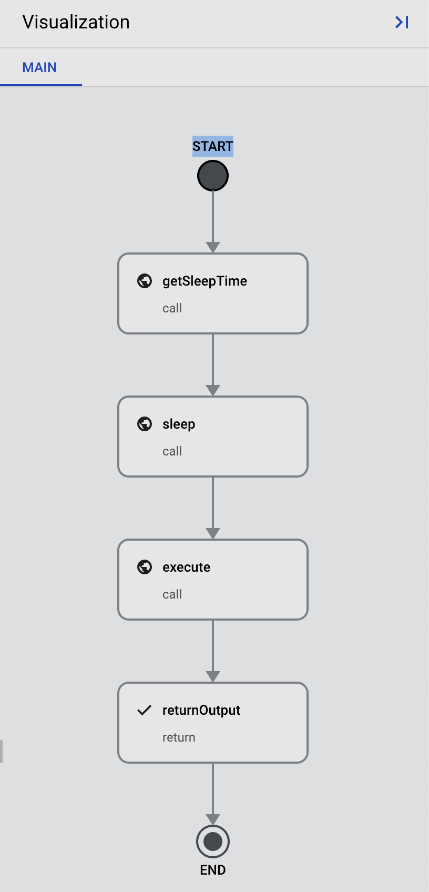

# L'Atten

    

This project is a system to automate HTTP requests or custom scripts that run on a schedule (similar to cron), but with a random time range functionality. This means the schedule is not exact but within the random range. The solution uses Google Cloud Services to be cost-effective for small daily hits, and eliminates the need for maintaining physical servers running 24/7 by leveraging serverless architecture. The primary components of this solution are Cloud Functions, Workflows, and Cloud Scheduler.

## Idea & Concept
The idea behind this project is to create a system that can execute HTTP requests or custom scripts on a flexible schedule. Instead of running tasks at exact times, the system randomizes the execution time within a predefined range. This can be helpful in situations where you want to avoid overloading your servers or when you need to simulate a more natural, less predictable pattern of requests.

## Stack & Architecture
The system uses Google Cloud Services for its cost-effective nature and powerful features:

1. Cloud Functions (Action): The action.py file contains a Google Cloud Function that processes incoming HTTP requests and performs the specified action. Actions include generating a random integer and executing custom code based on the action parameter.

2. Workflows: The workflow defines the steps to be executed, such as fetching a random sleep time, waiting for the specified duration, and finally executing the action. Workflow is pay-per-execution step, meaning that the cost is only incurred when the workflow is actively performing a step. Sleep time within the workflow does not contribute to the cost.

3. Cloud Scheduler: Cloud Scheduler is used as a trigger to start the workflow at specific times or intervals.

## Cost Analysis
The cost of this solution depends on three main components:

* Cloud Functions: You are billed for the number of invocations, compute time, and memory used. For small daily hits, the cost is minimal, and you may be eligible for the free tier.

* Workflows: You pay for the number of executed steps and the total number of workflow invocations. Since sleep time is not billed, you only pay for the active steps in the workflow.

* Cloud Scheduler: You are billed for the number of jobs and the number of successful executions.

For small-scale/personal use, the combined cost of these services is very cost-effective.

## How-To

1. Create a Google Cloud Project: If you don't already have one, create a new project in the [Google Cloud Console](console.cloud.google.com).

2. Enable required APIs: In your Google Cloud Project, enable the following APIs:
   * Cloud Functions API
   * Workflows API
   * Cloud Scheduler API

3. Deploy the Cloud Function:
   * Navigate to the [Cloud Functions](https://console.cloud.google.com/functions) section in the Google Cloud Console. 
   * Click "Create Function" and give it a name, like "random_scheduler_action". 
   * Select "Python 3.9" as the runtime. 
   * Use the contents of the `action.py` file provided in this repository as your function's source code.
   * Set the entry point to "main_http".
   * Click "Create" to deploy the function.

4. Create the Workflow:
   * Go to the [Workflows](https://console.cloud.google.com/workflows) section in the Google Cloud Console. 
   * Click "Create" and give your workflow a name, like "random_scheduler_workflow". 
   * Use the contents of the `workflow.yaml` file provided in this repository as your workflow's source code. 
   * Replace the `https://the.google.action.url` placeholder with the actual URL of your deployed Cloud Function. 
   * Click "Create" to save the workflow.
   
5. Set up Cloud Scheduler:
   * Navigate to the [Cloud Scheduler](https://console.cloud.google.com/cloudscheduler) section in the Google Cloud Console. 
   * Click "Create Job" to create a new scheduler job. 
   * For the first job:
     * Give your job a name, like "random_scheduler_job_baz".
     * Set the frequency using the cron syntax provided in the `schedules` section of the `scheduler.yaml` file. In this example, use "0 9 * * 1-5" for weekdays at 9:00 AM.
     * Set the target to "HTTP" and the URL to the URL of your Workflow. You can find this URL in the Workflows section of the Google Cloud Console.
     * Set the HTTP method to "POST" and add the `Content-type: application/json; charset=utf-8` header.
     * Set the body to the corresponding `workflow_arguments` from the `scheduler.yaml` file: `{"action": "baz"}`.
     * Click "Create" to save the job.
   * For the second job:
     * Repeat the steps above, but use a different name like "random_scheduler_job_qux".
     * Set the frequency to "0 18 * * 1-5" for weekdays at 6:00 PM.
     * Use the body `{"action": "qux"}` in the HTTP request.
     * Click "Create" to save the job.

Now your system is set up and ready to run. The Cloud Scheduler will trigger the Workflow at the specified times, which will then execute the Cloud Function after a random sleep time. The function will perform the specified action based on the input provided in the Workflow. Remember to update the code according to your need.
